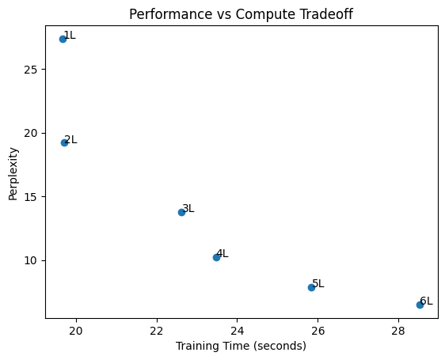

# Large Language Model from Scratch (Transformer)

## 🚀 Overview
This project implements a decoder-only Transformer (GPT-style LLM) from scratch using PyTorch. The goal was to deeply understand how LLMs work internally and to analyze how architectural and training choices affect performance.

---

## 📌 Visual Understanding

### Activation Function Comparison

### GPT Model Stages

### Transformer Architecture

---

## 🧠 Key Features
- Built a transformer-based LLM from scratch:
  - Multi-head self-attention
  - Positional embeddings
  - Feedforward layers (GELU)
  - Layer normalization
- Custom training loop for next-token prediction
- Text generation using temperature + top-k sampling

---

## 📊 Experiments & Analysis

### 🎯 Objective
To evaluate how **model depth impacts performance and compute cost**

---

### 📈 Key Results

| Layers | Perplexity | Training Time |
|--------|-----------|--------------|
| 1 | ~28 | ~20s |
| 2 | 248 | 3.87s |
| 3 | 223 | 11.18s |
| 4 | 195 → **10 (optimized)** | 24.11s |
| 5 | ~8 | Higher |
| 6 | ~6–7 | Highest |

---

### 📉 Performance vs Compute Tradeoff

---

## 🧠 Key Insights

- Increasing model depth improves performance (lower perplexity)
- Early layers provide the most significant gains
- Beyond a certain depth, improvements **diminish while compute increases**
- Optimal balance observed around **4–5 layers**
- Increasing dataset size and training duration reduced perplexity from **~195 → ~10 (~95% improvement)**

---

## 🧪 Qualitative Evaluation

Generated text quality improves significantly with model depth:

- **2 layers:** repetitive and incoherent output  
- **3 layers:** partial structure and grammar  
- **4+ layers:** structured dialogue and meaningful text generation  

---

## 🏗️ Tech Stack
- Python  
- PyTorch  
- NumPy  
- Matplotlib  

---

## ▶️ How to Run

### 1. Clone the Repository
git clone https://github.com/shourya5204/Large-Language-Model-from-Scratch.git  
cd Large-Language-Model-from-Scratch  

---

### 2. Create Virtual Environment (Recommended)
python3 -m venv venv  
source venv/bin/activate   # For Mac/Linux  

---

### 3. Install Dependencies
pip install -r requirements.txt  

---

### 4. Download Dataset
This project uses the Tiny Shakespeare dataset for training.

wget https://raw.githubusercontent.com/karpathy/char-rnn/master/data/tinyshakespeare/input.txt  

---

### 5. Run the Project
Launch Jupyter Notebook:

jupyter notebook  

Then open and run:

notebooks/llm_experiments.ipynb  

Run all cells sequentially to:
- Train the model  
- Perform experiments  
- Generate text  
- Visualize results  

---

## ⚡ Run on Google Colab (Recommended)

For faster training using GPU:

1. Open Google Colab  
2. Upload `notebooks/llm_experiments.ipynb`  
3. Enable GPU: Runtime → Change runtime type → GPU  
4. Run all cells  

---

## 📌 Notes
- Ensure the dataset file (`input.txt`) is in the same directory as the notebook  
- Training time depends on hardware (CPU vs GPU)  
- GPU (Colab) is recommended for faster experimentation  